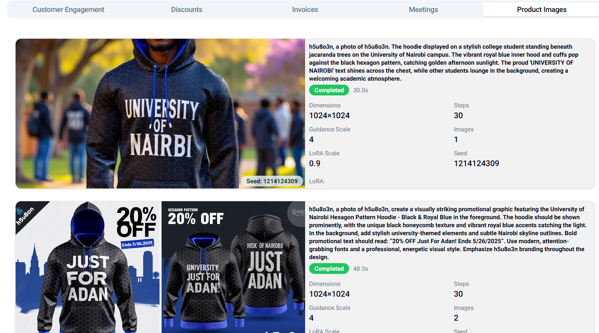
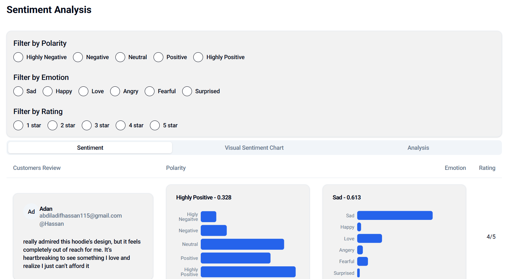
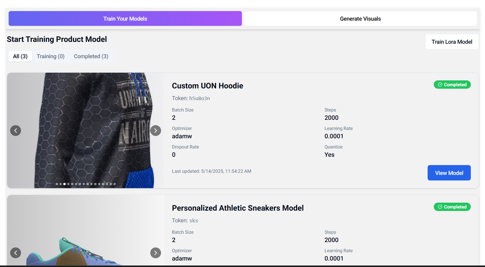
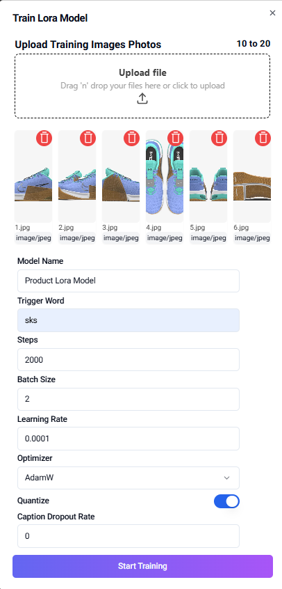
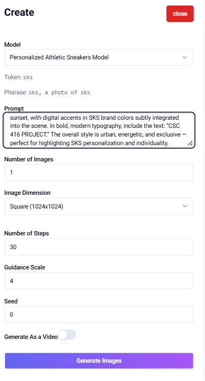

# Aura: The Autonomous AI-Driven Product Persona

[](https://aura-project-link.vercel.app) [](https://opensource.org/licenses/MIT)
[](https://www.typescriptlang.org/)
[](https://nextjs.org/)
[](https://runpod.io/)

Aura is a full-stack, AI-driven platform that transforms static products into autonomous digital personas. It empowers Small and Medium Enterprises (SMEs) by equipping their products with the intelligence to manage their own sales and marketing lifecycle, from autonomous promotion and content creation to direct client engagement and analysis.

**This is the main web application (built with Next.js) that serves as the central dashboard and user interface for the entire Aura ecosystem.**


## 🎯 The Problem

In today's competitive digital landscape, Small and Medium Enterprises (SMEs) struggle to keep pace with larger corporations. They often lack the resources, technical expertise, and budget to implement modern, data-driven sales and marketing strategies.

* **Manual Processes:** Marketing tasks are time-consuming, manual, and don't scale.
* **Lack of Insights:** SMEs can't easily analyze customer sentiment or track real-time market trends.
* **Resource Drain:** Creating engaging multimedia content and managing customer interactions (invoicing, scheduling, support) requires significant manual effort.

## 🖼️ Project Showcase

Here is a visual overview of Aura's core functionality.


|  |  |
| :---: | :---: |
|  |  |
|  | |
|  |  |
|  | |
|  |  |

| |  |
| :---: | :---: |
|  |  |

| |  |
| :---: | :---: |
|  |  |

---

## ✨ The Solution: Aura

Aura solves this by providing a single, autonomous platform that integrates a suite of powerful AI modules. It acts as an AI co-pilot for the SME, automating the entire marketing and sales process.

### Core Features

* **Product Persona Creation:** Users can "onboard" a product, giving it the ability to learn.
* **Dynamic Visual Content:** Autonomously trains a custom LoRA model for each product (`AuraTrain`)  and uses it to generate unique, context-aware marketing images and videos (`Auragen`).
* **AI-Powered Market Analysis:** Deploys an autonomous AI agent (`social_media_seo_agent`) that continuously scans social media and Google for real-time trends, high-impact keywords, and relevant hashtags to target.
* **Real-Time Sentiment Analysis:** A custom-trained sentiment model (`sentiment`) analyzes customer feedback to identify not just **polarity** (positive/negative) but also **emotion** (happy, sad, angry), providing deep insights.
* **Autonomous Sales & Engagement:** A customized LLM with function-calling capabilities (`Content-Planning-Module` / Function Calling) engages with customers 24/7. It can autonomously:
    * Offer targeted discounts.
    * Issue invoices.
    * Schedule meetings.
    * Generate product images on request.
* **Full Automation:** Uses cron jobs to trigger end-to-end campaigns, from market analysis and content generation to posting and engagement, all without human intervention.

---

## 🛠️ System Architecture

Aura is built on a **decoupled microservices architecture**. The main Next.js application (this repository) acts as the "brain" or control center. It communicates with a series of specialized AI/ML models deployed as independent, serverless GPU endpoints on **Runpod**.

This architecture ensures:
* **Scalability:** GPU-intensive tasks (like image generation) run on dedicated, scalable infrastructure and don't block the main application.
* **Modularity:** Each AI function is its own service, making it easy to update, test, or replace modules.
* **Cost-Effectiveness:** We leverage Runpod's serverless GPUs, paying only for the compute time we use during inference.

### Architecture Diagram


## 💻 Technology Stack

[cite_start]This project showcases a modern, end-to-end tech stack, from frontend development to MLOps [cite: 1202-1248].

| Category | Technologies |
| :--- | :--- |
| **Web App (Frontend/Backend)** | Next.js 14, React, TypeScript, Tailwind CSS, Node.js |
| **Database** | MongoDB (with Mongoose), hosted on MongoDB Atlas |
| **AI / Machine Learning** | PyTorch, Hugging Face (Transformers, Diffusers), Langchain, Scikit-learn, NLTK |
| **Cloud & Deployment** | **Vercel:** Web App Hosting & Cron Jobs <br> **Runpod:** Serverless GPU Endpoints for AI Models <br> **OnRender:** Hosting for persistent agents (SEO) <br> **Docker:** Containerization of AI services |
| **Object Storage** | Cloudflare R2 (for storing trained LoRA models and images) |
| **Development Tools** | VSCode, Git, GitHub |

---

## 🚀 Getting Started

This repository contains the main Next.js web application. To run this project, you must first deploy all the AI microservices (listed in the [Project Modules](#project-modules-the-microservices) section) to Runpod Serverless.

### Prerequisites

* [Node.js](https://nodejs.org/) (v18 or later)
* [Git](https://git-scm.com/)
* [MongoDB Atlas](https://www.mongodb.com/cloud/atlas) account (for `DATABASE_URL`)
* [Runpod](https://runpod.io/) account (for `RUNPOD_API_KEY` and deploying models)
* [Cloudflare R2](https://www.cloudflare.com/developer-platform/r2/) bucket (or any S3-compatible storage)

### 1. Clone the Repository

```bash
git clone [https://github.com/Hassan-jr/Aura.git](https://github.com/Hassan-jr/Aura.git)
cd Aura
````

### 2\. Install Dependencies

```bash
npm install
```

### 3\. Set Up Environment Variables

Create a `.env.local` file in the root of the project and fill it with the necessary keys. This is the **most important step** as it connects the frontend to your database and deployed AI modules.

```.env.example
# MongoDB Connection
DATABASE_URL="mongodb+srv://..."

# Runpod API Key (for making calls to endpoints)
RUNPOD_API_KEY="YOUR_RUNPOD_API_KEY"

# Cloudflare R2 (or S3) Storage Credentials
# Used for uploading training images and storing models
R2_ACCESS_KEY_ID="YOUR_R2_ACCESS_KEY"
R2_SECRET_ACCESS_KEY="YOUR_R2_SECRET_KEY"
R2_ENDPOINT_URL="YOUR_R2_ENDPOINT"
R2_BUCKET_NAME="YOUR_R2_BUCKET_NAME"

# --- Runpod Serverless Endpoint IDs ---
# These are the unique IDs for each of your deployed AI modules

# AuraTrain (Product LoRA Trainer)
AURA_TRAIN_ENDPOINT="YOUR_AURATRAIN_ENDPOINT_ID"

# Auragen (Image/Video Generator)
AURA_GEN_ENDPOINT="YOUR_AURAGEN_ENDPOINT_ID"

# Sentiment Analysis
SENTIMENT_ENDPOINT="YOUR_SENTIMENT_ENDPOINT_ID"

# Social Media & SEO Agent
SEO_AGENT_ENDPOINT="YOUR_SEO_AGENT_ENDPOINT_ID"

# Feature Extraction Model
FEATURE_EXTRACTION_ENDPOINT="YOUR_FEATURE_EXTRACTION_ENDPOINT_ID"

# Content Planning LLM (Function Calling)
CONTENT_PLANNING_ENDPOINT="YOUR_CONTENT_PLANNING_ENDPOINT_ID"
```

### 4\. Run the Development Server

```bash
npm run dev
```

Open [http://localhost:3000](https://www.google.com/search?q=http://localhost:3000) in your browser to see the application.

-----

## 📦 Project Modules (The Microservices)

The Aura ecosystem is composed of several repositories. The AI models are designed to be deployed as serverless endpoints on Runpod.

| Module | GitHub Repository | Purpose | Key Tech |
| :--- | :--- | :--- | :--- |
| **Aura (Main App)** | [Hassan-jr/Aura](https://github.com/Hassan-jr/Aura) | The main Next.js web application, dashboard, and API layer. | **Next.js, TypeScript** |
| **Auragen** | [Hassan-jr/Auragen](https://github.com/Hassan-jr/Auragen) | Inference-optimized API to generate product images & videos using a trained LoRA model. | **Python, PyTorch, Diffusers** |
| **AuraTrain** | [Hassan-jr/AuraTrain](https://github.com/Hassan-jr/AuraTrain) | Takes 10-20 product images, trains a custom LoRA model, and saves it to R2 storage. | **Python, Diffusers, PyTorch** |
| **SEO/Social Agent**| [Hassan-jr/social\_media\_seo\_agent](https://github.com/Hassan-jr/social_media_seo_agent) | Autonomous agent that scrapes Google & social media for trends, keywords, and hashtags. | **Python, Phidata, Langchain** |
| **Sentiment Model**| [Hassan-jr/sentiment](https://github.com/Hassan-jr/sentiment) | Fine-tuned BERT model to classify text for both polarity (5-star) and emotion (6 classes). | **Python, Transformers, PyTorch** |
| **Feature Extractor**| [Hassan-jr/feature\_extraction\_model](https://github.com/Hassan-jr/feature_extraction_model) | A fine-tuned KBIR model for token classification to extract keyphrases from text. | **Python, Transformers** |
| **Content Planner**| [Hassan-jr/Content-Planning-Module](https://github.com/Hassan-jr/Content-Planning-Module) | LLM with function-calling to handle customer engagement (invoices, discounts, etc.). | **Python, Langchain** |

-----

## 📜 License

This project is licensed under the MIT License. See the [LICENSE](https://www.google.com/search?q=LICENSE) file for details.

## 👤 Author

**Abdiladif Hassan Adan**

  * [GitHub](https://www.google.com/search?q=https.github.com/Hassan-jr)
  * [LinkedIn](https://www.google.com/search?q=https://www.linkedin.com/in/your-linkedin-profile/) \`\`\`