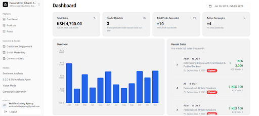
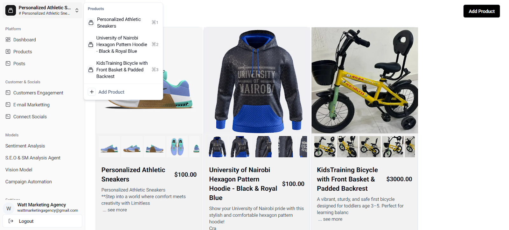
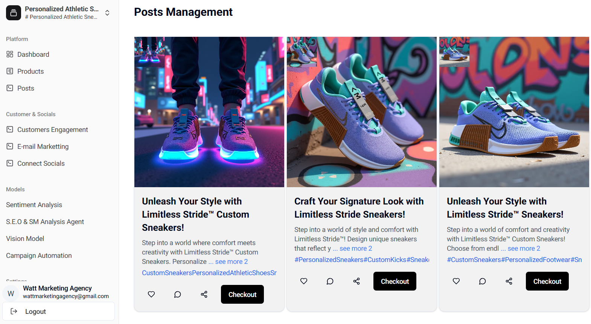
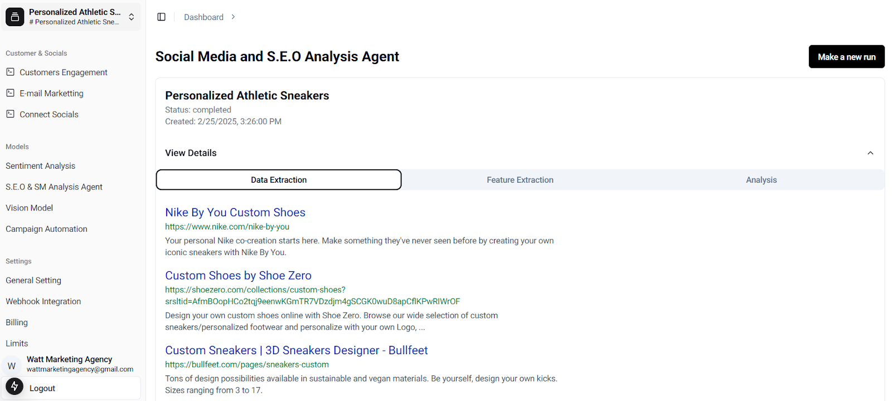
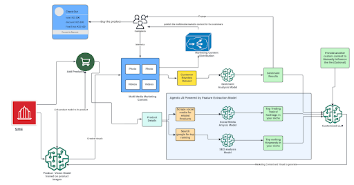

# Aura: The Autonomous AI-Driven Product Persona

[](https://aura-project-link.vercel.app) 
[](https://opensource.org/licenses/MIT)
[](https://www.typescriptlang.org/)
[](https://nextjs.org/)
[](https://runpod.io/)
[](https://pytorch.org/)

> **Transforming static products into autonomous intelligent digital entities that can market, sell, and engage.**

Aura is an end-to-end **Autonomous AI Platform** designed to empower Small and Medium Enterprises (SMEs). It gives products a "digital life," allowing them to autonomously manage their own sales and marketing lifecycle—from generating their own promotional content to negotiating discounts with customers and more.

**This repository houses the main Next.js web application, which serves as the central command center for the Aura ecosystem.**

---

## 🖼️ Project Showcase

Aura integrates complex AI workflows into a seamless UI.

<div align="center">
  
</div>
<br/>

|  |  |
| :---: | :---: |
|  |  |
|  |  |
|  |  |

---

## 🎯 The Problem

In the modern digital economy, SMEs are at a disadvantage. While large corporations deploy massive teams for data-driven marketing, SMEs struggle with:
* **Resource Constraints:** High-quality content creation and 24/7 customer engagement require budgets SMEs don't have.
* **Data Blindness:** They lack the tools to analyze real-time customer sentiment or emerging SEO trends.
* **Manual Bottlenecks:** Marketing remains a manual, unscalable process.

## ✨ The Solution: Aura

Aura acts as an **AI Co-Pilot**, automating the entire pipeline. It doesn't just assist; it acts.

### 🧠 Core Capabilities

* **🤖 Product Persona Onboarding:** The system "learns" the product, creating a unique digital identity.
* **🎨 Autonomous Content Generation:** Aura autonomously trains a custom **LoRA (Low-Rank Adaptation)** model on your product images. It then uses this model to generate infinite, hyper-realistic marketing visuals in any context (`Auragen`).
* **📈 Real-Time Market Intelligence:** An autonomous AI agent continuously scrapes social media and Google Search to identify trending topics, hashtags, and high-impact keywords (`social_media_seo_agent`).
* **❤️ Deep Sentiment Analysis:** A custom fine-tuned **BERT model** analyzes customer reviews to detect not just polarity (Positive/Negative) but specific emotions (Happy, Sad, Angry, Love), enabling empathetic responses (`sentiment`).
* **💬 Autonomous Sales Agent:** A customized **LLM with Function Calling** handles the entire sales conversation. It can:
    * Negotiate and issue targeted discounts.
    * Generate and send invoices instantly.
    * Schedule meetings with human staff.
    * Generate custom product images on user request.
* **⚡ End-to-End Automation:** Cron jobs orchestrate the entire flow: scan trends -> generate content based on trends -> publish -> engage with comments.

---

## 🛠️ System Architecture

Aura utilizes a **Decoupled Microservices Architecture** to ensure scalability and cost-efficiency.

* **The Brain:** This Next.js application handles the UI, business logic, and orchestration.
* **The Muscle:** Heavy AI workloads (Training, Inference, LLMs) are offloaded to independent **Serverless GPU Endpoints** on Runpod.

### High-Level Architecture


---

## 📦 The Aura Ecosystem (Microservices)

Aura is not a monolith. It is a suite of specialized AI services working in concert.

| Service | Repository | Tech Stack | Role |
| :--- | :--- | :--- | :--- |
| **Aura (Core)** | [Hassan-jr/Aura](https://github.com/Hassan-jr/Aura) | **Next.js, TypeScript, MongoDB** | The central dashboard, API gateway, and user interface. |
| **Auragen** | [Hassan-jr/Auragen](https://github.com/Hassan-jr/Auragen) | **Python, PyTorch, Diffusers** | Inference API for generating product images using LoRA. |
| **AuraTrain** | [Hassan-jr/AuraTrain](https://github.com/Hassan-jr/AuraTrain) | **Python, Diffusers** | Automated pipeline to fine-tune Stable Diffusion LoRAs on product images. |
| **SEO Agent** | [Hassan-jr/social_media_seo_agent](https://github.com/Hassan-jr/social_media_seo_agent) | **Phidata, Langchain** | Autonomous agent for scraping and analyzing market trends. |
| **Sentiment** | [Hassan-jr/sentiment](https://github.com/Hassan-jr/sentiment) | **Transformers (BERT), PyTorch** | NLP service for emotion and polarity classification. |
| **Feature Extractor** | [Hassan-jr/feature_extraction_model](https://github.com/Hassan-jr/feature_extraction_model) | **Transformers (KBIR)** | Token classification model to extract keyphrases from text. |
| **Sales Agent** | [Hassan-jr/Content-Planning-Module](https://github.com/Hassan-jr/Content-Planning-Module) | **Langchain, OpenAI** | LLM with function calling for sales, invoicing, and scheduling. |

---

## 💻 Technology Stack

Aura represents a modern, full-stack approach to AI engineering.

| Domain | Technologies |
| :--- | :--- |
| **Frontend & Backend** | Next.js 14, React, TypeScript, Tailwind CSS, Node.js |
| **Database** | MongoDB (Mongoose), hosted on Atlas |
| **AI & ML** | PyTorch, Hugging Face, Diffusers, Langchain, Scikit-learn, NLTK |
| **Infrastructure** | **Vercel** (Web), **Runpod Serverless** (GPU Inference), **Docker** (Containerization) |
| **Storage** | **Cloudflare R2** (Object Storage for Models & Images) |

---

## 🚀 Getting Started

### Prerequisites
* Node.js v18+
* MongoDB Atlas Account
* Runpod Account (for GPU endpoints)
* Cloudflare R2 Bucket

### Installation

1.  **Clone the Repository**
    ```bash
    git clone [https://github.com/Hassan-jr/Aura.git](https://github.com/Hassan-jr/Aura.git)
    cd Aura
    ```

2.  **Install Dependencies**
    ```bash
    npm install
    ```

3.  **Configure Environment**
    Create a `.env.local` file. This connects the "Brain" (Next.js) to the "Muscle" (AI Endpoints).
    
    ```env
    # Database
    DATABASE_URL="mongodb+srv://..."

    # Cloud Storage (Cloudflare R2)
    R2_ACCESS_KEY_ID="key"
    R2_SECRET_ACCESS_KEY="secret"
    R2_ENDPOINT_URL="url"
    R2_BUCKET_NAME="aura-bucket"

    # AI Infrastructure (Runpod)
    RUNPOD_API_KEY="rp_..."
    
    # AI Microservice IDs (Deployed on Runpod)
    AURA_TRAIN_ENDPOINT="xxxxxxxx"
    AURA_GEN_ENDPOINT="xxxxxxxx"
    SENTIMENT_ENDPOINT="xxxxxxxx"
    SEO_AGENT_ENDPOINT="xxxxxxxx"
    CONTENT_PLANNING_ENDPOINT="xxxxxxxx"
    ```

4.  **Run Development Server**
    ```bash
    npm run dev
    ```

---

## 👤 Author

**Abdiladif Hassan**

[](https://www.linkedin.com/in/hassanjr) 
[](https://github.com/Hassan-jr)

---

## 📜 License

This project is licensed under the MIT License.